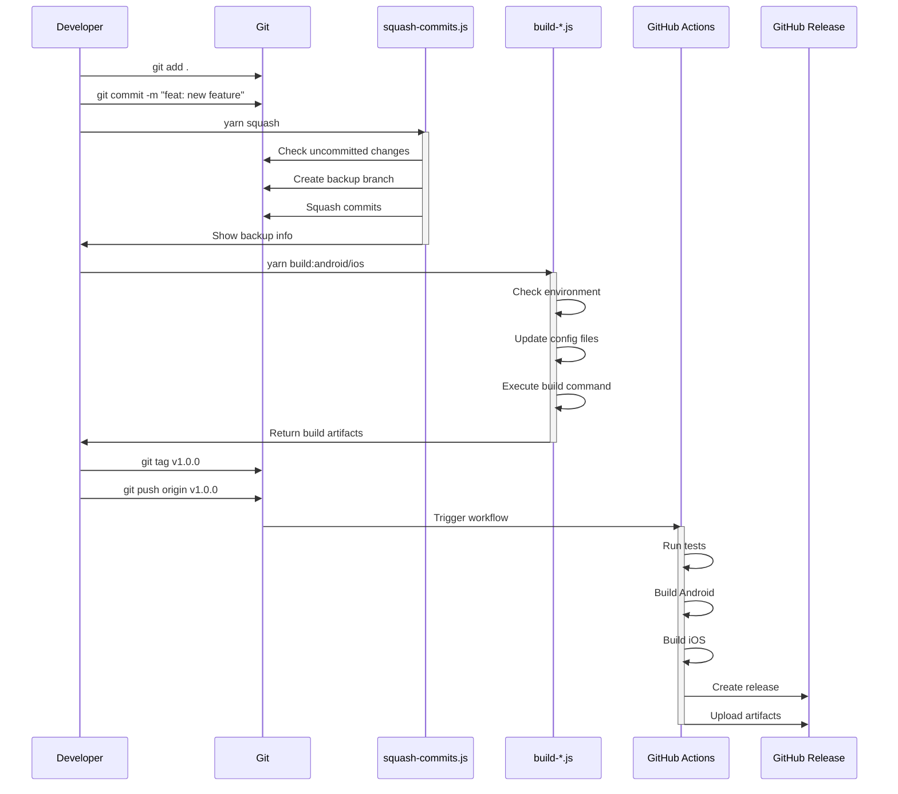
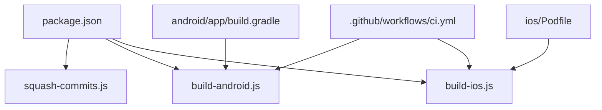

# Scripts Sequence Diagram



## Scripts Overview

### 1. squash-commits.js

- **Purpose**: Squash multiple commits into one
- **Flow**:
  1. Check for uncommitted changes
  2. Create backup branch
  3. Squash commits
  4. Provide restore instructions

### 2. build-android.js

- **Purpose**: Build Android app for different environments
- **Flow**:
  1. Validate environment and build type
  2. Update Android config files
  3. Execute Gradle build
  4. Output APK files

### 3. build-ios.js

- **Purpose**: Build iOS app for different environments
- **Flow**:
  1. Validate environment and build type
  2. Update iOS config files
  3. Execute xcodebuild
  4. Output IPA files

### 4. CI/CD Workflow (.github/workflows/ci.yml)

- **Purpose**: Automate build and release process
- **Flow**:
  1. Validate commits
  2. Run tests
  3. Build apps
  4. Create release
  5. Upload artifacts

## File Dependencies



## Environment Variables

### Android Build

- `ENV`: development | staging | production
- `BUILD_TYPE`: debug | release
- `APP_NAME`: App name for current environment
- `PACKAGE_NAME`: Package name for current environment

### iOS Build

- `ENV`: development | staging | production
- `BUILD_TYPE`: debug | release
- `APP_NAME`: App name for current environment
- `BUNDLE_ID`: Bundle ID for current environment

## Usage Examples

### Squash Commits

```bash
# Squash commits before PR
yarn squash
```

### Build Android

```bash
# Development build
yarn build:android:dev

# Production release
yarn build:android:prod:release
```

### Build iOS

```bash
# Development build
yarn build:ios:dev

# Production release
yarn build:ios:prod:release
```

### Create Release

```bash
# Create and push tag
git tag v1.0.0
git push origin v1.0.0
```
